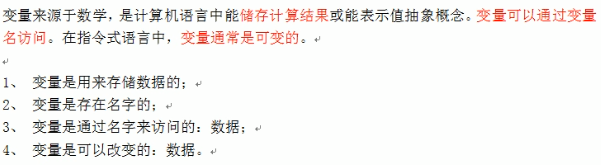
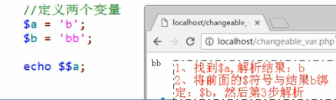
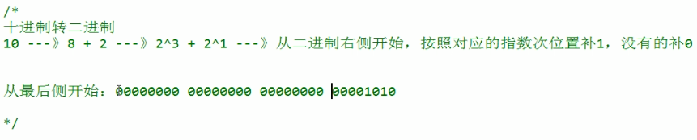
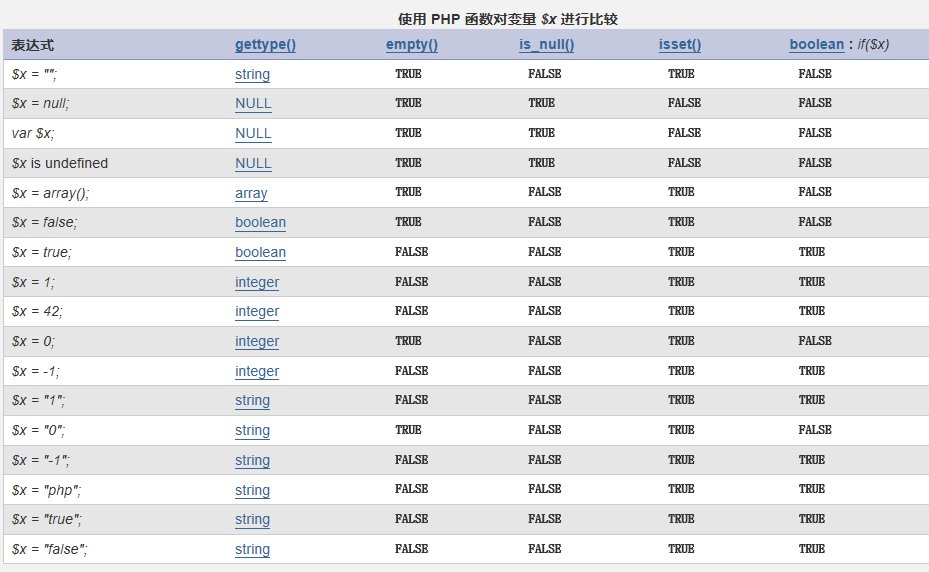
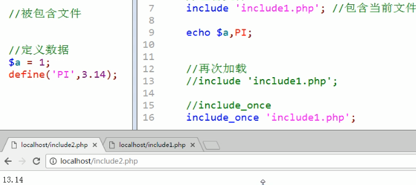
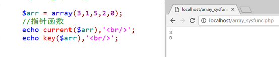
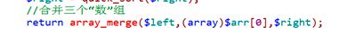

<p align = "center"><font color = "rgb(1,50,177)" size = "9">PHP+Apache+MySQL</font></p>

<p align = "center" ><font color = "orange">瀑力汽水</font></p>


<hr/>

- [搭建环境](#搭建环境)
  - [P1 PHP简介](#p1-php简介)
      - [什么是PHP](#什么是php)
      - [PHP发展史](#php发展史)
      - [静态网站与动态网站的区别](#静态网站与动态网站的区别)
  - [P2 网站基本概念](#p2-网站基本概念)
      - [服务器概念](#服务器概念)
      - [IP的概念[^（每台电脑都有一个唯一的IP地址）]](#ip的概念每台电脑都有一个唯一的ip地址)
      - [域名](#域名)
      - [DNS](#dns)
      - [端口](#端口)
  - [P3 静态网站访问流程](#p3-静态网站访问流程)
  - [P4 动态网站访问流程](#p4-动态网站访问流程)
  - [P5 安装Apache及目录介绍](#p5-安装apache及目录介绍)
  - [P6 安装Apache之httpd.exe介绍](#p6-安装apache之httpdexe介绍)
  - [P7 配置默认站点](#p7-配置默认站点)
  - [P8 安装与配置PHP](#p8-安装与配置php)
      - [安装配置](#安装配置)
      - [PHP目录结构说明](#php目录结构说明)
  - [P9 Apache加载PHP模块](#p9-apache加载php模块)
  - [P10 安装MySQL](#p10-安装mysql)
  - [P11 MySQL目录说明](#p11-mysql目录说明)
      - [结构目录说明](#结构目录说明)
        - [Bin目录的常用命令](#bin目录的常用命令)
        - [补充：软件设计结构：C/S和B/S](#补充软件设计结构cs和bs)
  - [P12 MySQL访问流程](#p12-mysql访问流程)
  - [P13 PHP加载MySQL](#p13-php加载mysql)
        - [设定PHP的系统时区](#设定php的系统时区)
  - [P14 虚拟主机简介](#p14-虚拟主机简介)
      - [配置虚拟主机](#配置虚拟主机)
      - [什么是虚拟主机](#什么是虚拟主机)
      - [虚拟主机的分类](#虚拟主机的分类)
  - [P15 配置基于域名的虚拟主机](#p15-配置基于域名的虚拟主机)
- [PHP基础](#php基础)
  - [P16 PHP标记与注释](#p16-php标记与注释)
        - [PHP语法初步认识](#php语法初步认识)
        - [PHP代码标记](#php代码标记)
        - [PHP注释](#php注释)
  - [P17 PHP语句结束符](#p17-php语句结束符)
        - [PHP语句分隔符](#php语句分隔符)
  - [P18 变量概念及使用](#p18-变量概念及使用)
  - [P19变量命名规则和预定义变量及可变变量](#p19变量命名规则和预定义变量及可变变量)
        - [变量命名规则](#变量命名规则)
        - [预定义变量](#预定义变量)
        - [可变变量](#可变变量)
  - [P20 变量传值](#p20-变量传值)
          - [①值传递](#值传递)
          - [②引用传递](#引用传递)
          - [代码实现](#代码实现)
  - [P21 常量的定义和使用](#p21-常量的定义和使用)
  - [P22 系统常量](#p22-系统常量)
  - [P23 数据类型分类](#p23-数据类型分类)
  - [P24 数据类型转换](#p24-数据类型转换)
  - [P25 数据类型判断](#p25-数据类型判断)
  - [P26 整数类型进制简介](#p26-整数类型进制简介)
  - [P27 整数类型进制转换](#p27-整数类型进制转换)
  - [P28 浮点型和布尔型](#p28-浮点型和布尔型)
        - [浮点类型](#浮点类型)
        - [布尔类型](#布尔类型)
  - [P29 赋值、算数、比较运算符](#p29-赋值算数比较运算符)
  - [P30 运算符之逻辑运算符](#p30-运算符之逻辑运算符)
        - [逻辑运算符](#逻辑运算符)
  - [P31 连接、错误抑制、三目运算符](#p31-连接错误抑制三目运算符)
        - [连接运算符](#连接运算符)
        - [错误抑制符](#错误抑制符)
        - [三目运算符](#三目运算符)
  - [P32 自操作运算符](#p32-自操作运算符)
  - [P33 计算机码、位运算符、运算符优先级](#p33-计算机码位运算符运算符优先级)
        - [计算机码](#计算机码)
        - [位运算符](#位运算符)
        - [运算符优先级](#运算符优先级)
  - [P34 顺序、分支、循环结构介绍](#p34-顺序分支循环结构介绍)
        - [流程控制](#流程控制)
        - [控制分类](#控制分类)
          - [1、顺序结构](#1顺序结构)
          - [2、分支结构](#2分支结构)
          - [3、循环结构](#3循环结构)
        - [循环控制](#循环控制)
  - [P35 流程控制替代语法](#p35-流程控制替代语法)
  - [P36 文件包含](#p36-文件包含)
        - [文件包含的作用](#文件包含的作用)
        - [文件包含四种形式](#文件包含四种形式)
        - [文件加载原理](#文件加载原理)
        - [include 和 include_once 的区别](#include-和-include_once-的区别)
        - [include 和 require 的区别](#include-和-require-的区别)
  - [P37 文件包加载路径](#p37-文件包加载路径)
        - [文件加载路径](#文件加载路径)
        - [文件嵌套包含](#文件嵌套包含)
  - [P38 函数](#p38-函数)
        - [基本概念](#基本概念)
        - [定义语法](#定义语法)
        - [函数命名规范](#函数命名规范)
  - [P39 参数详解](#p39-参数详解)
        - [形参](#形参)
        - [实参](#实参)
        - [默认值](#默认值)
        - [引用传递](#引用传递-1)
  - [P40 函数体](#p40-函数体)
        - [函数体](#函数体)
        - [函数返回值](#函数返回值)
  - [P41 作用域](#p41-作用域)
  - [P42 静态变量](#p42-静态变量)
  - [P43 可变函数](#p43-可变函数)
  - [P44 匿名函数](#p44-匿名函数)
        - [基本概念](#基本概念-1)
        - [闭包](#闭包)
  - [P45 伪类型](#p45-伪类型)
  - [P46 常用系统函数之输出函数和时间函数](#p46-常用系统函数之输出函数和时间函数)
        - [有关输出的函数](#有关输出的函数)
        - [有关时间的函数](#有关时间的函数)
        - [有关数学的函数](#有关数学的函数)
        - [有关函数的函数](#有关函数的函数)
  - [P47 错误处理](#p47-错误处理)
        - [错误分类](#错误分类)
        - [错误代号](#错误代号)
        - [错误触发](#错误触发)
        - [错误显示设置](#错误显示设置)
        - [错误日志设置](#错误日志设置)
        - [自定义错误处理](#自定义错误处理)
  - [P48 字符串类型](#p48-字符串类型)
        - [字符串定义语法](#字符串定义语法)
        - [字符串转义](#字符串转义)
        - [结构化定义字符串变量的规则](#结构化定义字符串变量的规则)
  - [P49 字符串长度问题](#p49-字符串长度问题)
  - [P50 字符串相关函数](#p50-字符串相关函数)
        - [1）转换函数[^implode(), explode(), str_split()]](#1转换函数implode-explode-str_split)
        - [2）截取函数[^trim(), ltrim(), rtrim()]](#2截取函数trim-ltrim-rtrim)
        - [3）截取函数[^substr(), strstr()]](#3截取函数substr-strstr)
        - [4）大小转换函数[^strtolower(), strtoupper(), ucfirst()]](#4大小转换函数strtolower-strtoupper-ucfirst)
        - [5）查找函数[^strpos(), strrpos()]](#5查找函数strpos-strrpos)
        - [6）替换函数[^str_replace()]](#6替换函数str_replace)
        - [7）格式化函数[^printf(), sprintf()]](#7格式化函数printf-sprintf)
        - [8）其他[^str_repeat(), str_shuffle()]](#8其他str_repeat-str_shuffle)
  - [P51 数组](#p51-数组)
        - [数组的概念](#数组的概念)
        - [数组定义语法](#数组定义语法)
        - [PHP数组特点](#php数组特点)
  - [P52 多维数组](#p52-多维数组)
        - [二维数组](#二维数组)
        - [多维数组](#多维数组)
        - [异形数组（不规则数组）](#异形数组不规则数组)
  - [P53 数组遍历](#p53-数组遍历)
        - [遍历的基本含义](#遍历的基本含义)
        - [foreach遍历语法](#foreach遍历语法)
        - [foreach遍历原理](#foreach遍历原理)
        - [for循环遍历数组](#for循环遍历数组)
        - [while配合each和list遍历数组](#while配合each和list遍历数组)
        - [**list**函数使用](#list函数使用)
        - [list与each配合特别好](#list与each配合特别好)
  - [P54 数组的相关函数](#p54-数组的相关函数)
      - [1.  排序函数](#1--排序函数)
      - [2. 指针函数](#2-指针函数)
      - [3. 其他函数](#3-其他函数)
  - [P55 编程思想](#p55-编程思想)
      - [编程思想](#编程思想)
      - [递<u>推</u>算法](#递u推u算法)
      - [递<u>归</u>算法](#递u归u算法)
  - [P56 数组排序排序](#p56-数组排序排序)
      - [冒泡排序](#冒泡排序)
      - [选择排序](#选择排序)
      - [插入排序](#插入排序)
      - [快速排序](#快速排序)
      - [归并排序](#归并排序)
  - [P57 查找算法](#p57-查找算法)
      - [顺序查找算法](#顺序查找算法)
      - [二分（折半）查找算法](#二分折半查找算法)

<hr/>


# 搭建环境

## P1 PHP简介

#### 什么是PHP


#### PHP发展史


#### 静态网站与动态网站的区别

- 网站

  

- 静态网站特点

  

- 动态网站特点（解决静态网站的缺点）

  


## P2 网站基本概念

#### 服务器概念


#### IP的概念[^（每台电脑都有一个唯一的IP地址）]

​	**但每个IP地址都绑定在电脑的网卡上，不排除一台电脑有多块网卡**


#### 域名


#### DNS

​	DNS（Domain Name System，域名系统），因特网上作为域名和IP地址之间相互映射的一个分布式数据库，能够使用户更方便的访问互联网，而不用去记住能够被机器直接读取的IP数串。通过主机名，最终得到该主机名对应的IP地址的过程叫做域名解析（或主机名解析）。

用户输入域名localhost----> DNS（local host 127.0.0.1）----->服务器电脑

#### 端口


## P3 静态网站访问流程

流程：浏览器发起访问--->DNS解析域名--->服务器电脑--->服务软件


## P4 动态网站访问流程

动态网站访问流程与静态差不多，但会多出几个内容：服务器端解析、数据库[^动态特性]


## P5 安装Apache及目录介绍

https://www.bilibili.com/video/BV18x411H7qD?p=5

目录介绍


## P6 安装Apache之httpd.exe介绍

- httpd.exe使Apache服务器的进程：运行之后才能够工作


- httpd.exe可以用来查看Apache具有哪些功能及配置文件是否有错（但使用的时候要进入其所在目录）

  

- 查看使用的模块：`http -M`（但使用的时候要进入其所在目录）

  

- 验证配置文件是否有效：`httpd -t`

  


## P7 配置默认站点

1、让Apache确定服务器上访问的位置：网站文件夹所在的位置

<font color = "orange">Hpptd.conf : DocumentRoot</font>


2、为方便用户使用对应域名访问对应网站：给文件夹对应的取一个别名

<font color = "orange">Hpptd.conf : ServerName</font>


3、调整监听端口

<font color = "orange">Hpptd.conf : Listen</font>


4、<font color="red">凡是涉及到Apache配置文件的修改，那么需要重启Apache才能生效</font>

5、实现DNS域名解析：通常默认站点都是本地DNS：hosts文件

​	<font color = "rgb()">hosts文件路径：C:\Windows\System32\drivers\etc\hosts</font>

	


## P8 安装与配置PHP

https://www.bilibili.com/video/BV18x411H7qD?p=8

#### 安装配置

- 下载安装包 PHP官网：https://windows.php.net/download/

  
  
    
  
- 将PHP的安装包解压缩到自己网站文件夹下更改文件夹名为php5（视版本而定）

  


#### PHP目录结构说明


## P9 Apache加载PHP模块

​	？？？

​	如上网址请求的是Apache服务器，但是apache服务器和PHP没什么关系才会产生如上图的这种情况。

**配置如下**

1、Apache加载PHP模块：再Apache的主配置文件中加载对应的PHP提供的模块

​	<font color = "red">LoadModule php5_module (PHP所提供的模块的路径)</font>[^ apache中的httpd.conf]

​	

​	(可以使用httpd.exe -t检查是否有语法错误，然后用httpd.exe -M查看所有模块)

2、Apache分配工作给PHP模块：如果是PHP代码就交给PHP处理：文件判断后缀.php结尾必为PHP文件

    AddType application/x-httpd-php .php
​	

3、将PHP的配置文件加载到Apache配置文件中：使其共同生效

 - 在Apache中指定PHP配置文件所在路径

   ```PHP
   PHPIniDir (php.ini所在路径)
   ```

   

- php.ini文件是默认不存在的，是以development和production格式存在，需要进行格式化，如下

  - 找到其所在位置

    

  - 将文件复制一份名字改成

  <font color = "blue">说明：PHP的配置文件已经加入到Apache的配置项中，意味着php.ini的修改需要Apache重启才会生效</font>


## P10 安装MySQL

- 获取MySQL软件https://downloads.mysql.com/archives/community/

  > 使用ZIP安装的要配置各种信息https://blog.csdn.net/weixin_42869365/article/details/83472466

  

  

  

- 选择Custom，自定义安装

  

- 选择安装路径

  - 软件安装目录：server/mysql

    

  - 数据安装目录: server/mysql/data

    

- 在完成安装后，要实现配置

  

- 选择详细配置（默认）

  

  

- 选择开发环境（默认）

  

- 选择功能（默认）

  

- 并发设置（建议手动）

  

- 配置访问环境 

  

- 字符集设定

  

- 服务安装：将MySQL作为Windows下的一个服务去启动[^这样就不用手动启动了]

  

  

- 输入root用户的密码

  

- 等待配置：四个都要勾选才算成功

  

  


## P11 MySQL目录说明


#### 结构目录说明


##### Bin目录的常用命令


##### 补充：软件设计结构：C/S和B/S

>C/S : Client客户端 / Server服务端，用户需要安装客户端产品才能访问服务器，而且只能访问一种软件（QQ、WeChat）
>
>B/S：Browser浏览器 / Server服务端，用户只需要安装浏览器，就可以访问所有的**<u>服务器</u>**[^支持B/S架构服务]


##  P12 MySQL访问流程


MySQL是一款C/S架构的软件，需要通过客户端来访问服务端（MySQL提示也提供了其他模式的访问：通过一些插件扩展来充当客户端）

1、启用MySQL客户端：mysql.exe,该软件本身可以通过CMD控制台运行


2、MySQL客户端访问服务端要进行寻找匹配：连接  认证

- 连接：IP和端口确认，如果是本地都可以省略

  ​			-h主机地址 ----- 》 -hlocalhost（可以是IP）

  ​			-P端口 ------------》 -P3306

- 认证：通过用户名和密码进入服务器

  ​			-u用户名 ---------》 -uroot[^root是用户名]，不可省略 （匿名用户除外）

  ​			-p密码-------------》 -proot[^root是密码]

  

3、退出命令：\q或exit或quit


**注意**：通常连接认证的时候密码不建议明文，可以在输入-p之后回车，系统会再次让输入密码，这个时候就是密文


​	


## P13 PHP加载MySQL

PHP本身不具备操作MySQL数据库的能力，需要借助PHP操作MySQL的扩展来实现。

1、PHP要加载MySQL扩展：php.ini文件中设置

> 在php.ini中使用搜索功能搜索mysql，将extension=php_mysql.dll前面的 ; 去掉，即可（如果找不到php.ini这个文件，请回看P9）
>
> 另外，如果你的PHP版本较高，使用
>
> 也是一样的
>
> php5.5起不建议使用 php_mysql 扩展
> php7 取消了 php_mysql 扩展

​	


2、PHP中所有的扩展都是在ext文件夹中，需要指定扩展所在路径：`extension_dir`

​	

3、php.ini已经被Apache加载，所以需要重启才会生效

​	


> 验证：将index.php重写成下图
>
> 
>
> ​			然后再浏览器中实现
>
> ​			最后会出现如下图效果，记为成功
>
> ​			


##### 设定PHP的系统时区

通过`phpinfo()`函数发现，还存在一个错误，这个错误表明当前使用的是系统默认的时区，不安全，我们要调整为自己的时区


通过php.ini中的timezone配置项来实现（我们的中国时区简称是PRC），设置完成后再重启Apache


## P14 虚拟主机简介

#### 配置虚拟主机

一台服务器很贵，如果只能部署一个网站，那么非常浪费，所以要通过其他渠道来实现一台主机上部署多个网站。

#### 什么是虚拟主机

虚拟主机：Virtual machine，并不存在真实的主机，但是可以提供真实主机所实现的功能

通俗的讲，虚拟主机就是将计算机中不同的文件夹进行不同的命名，然后可以实现让服务器(Apache)根据用户的需求从不同的文件夹中（网站）中读取不同的内容。

#### 虚拟主机的分类

在Apache中，可以将虚拟主机划分成两类：

1、基于IP的虚拟主机：一台电脑上有多个IP，每个IP对应一个网站

​	原理：电脑默认只有一个IP，因为通常只配有一个网卡，但是有的电脑（服务器居多）可以配置多个网卡，每个网卡可以绑定一个IP地址。

2、基于域名的虚拟主机：一台电脑上只有一个IP，但是IP下可以制作多个网站，但是需要给每个网站不同的名字（虚拟主机名）


## P15 配置基于域名的虚拟主机

视频🔗：https://www.bilibili.com/video/BV1qg4y1q7DU/?spm_id_from=333.788.b_636f6d6d656e74.45

在Apache中，虚拟主机的搭建有两种方式：

1、在主配置文件中搭建：需要手动开启虚拟主机（基于域名）

​		NameVirtualHost *:80

2、在专门的虚拟主机配置文件中配置

- 在主配置文件中加载虚拟主机配置文件：虚拟主机配置文件已经开启了虚拟主机

  在主机配置文件中找Virtual hosts

  ​			

  

  

  > 然后就可以看到如下图的文件中已存在
  >
  > 
  >
  > 

- 虚拟主机配置文件中配置虚拟主机

  - 增加一个对应的站点文件夹位置：<font color = "red">DocumentRoot</font>

    > 注意：要添加对应的文件夹

    

  - 增加主机名字：文件夹的别名：<font color = "red">ServerName</font>

    

  - 增加域名解析DNS：hosts[^C:/Windows/System32/drivers/etc/]

    

    ​					

  - 需要给当前设定的站点（目录）访问权限 【在中】

    ```txt
    <Directory '站点目录'>
    	Order Deny,Allow    //没有顺序关系：实际顺序有意义
    	Deny from 指定的范围（IP）
    	Allow from 指定范围/all
    </Directory>
    ```

    

  - 配置访问列表：当访问是一个目录时（没有指定具体要访问的文件）

    Options Indexes [FollowSymLinks\][^可有可无：如果访问目录或没有网页文件，那么列表显示目录中的所有文件（一般是用于开发者的）]

    

    

  - 当用户访问指定目录不指定文件的时候，通常需要系统指定一个默认文件

    DirectoryIndex 默认文件列表[^使用空格分隔]

    > DirectoryIndex index.html index.htm index.php

    

  - 重启Apache

  > 注意：如果说网站中整个网站根目录允许访问，但是其中还有其他文件夹不允许访问：可以增加多个Directory标签，针对不同文件夹

- 注意：一旦启用虚拟主机配置文件，那么默认的主机地址localhost就不再生效，如果想要生效：为localhost增加单独的虚拟主机，如下，记得重启Apache

  

  

  

  


# PHP基础


## P16 PHP标记与注释

##### PHP语法初步认识

PHP是一种运行在服务器端的脚本语言，可以嵌入到HTML中

##### PHP代码标记

在PHP发展史中，可以使用多种标记来区分PHP脚本 

> - [ ] ASP标记：<%  php代码  %>
>
> - [ ] 短标记：<? php代码 ?>
>
> 以上两种均已弃用，如果要使用那么需要在配置文件中开启
>
> 
>
> - [ ] 脚本标记: `<script language = "php">php代码</script>`
>
> - [ ] 标准标记（常用）：<?php php代码 ?>

##### PHP注释

- 行注释：一次注释一行	//或#

- 块注释：一次注释多行    /*     */

  ​	


## P17 PHP语句结束符

##### PHP语句分隔符


​	


## P18 变量概念及使用

- 变量

  

- 变量基本概念

  

- 变量的使用

  PHP中的所有变量都必须使用“$”符号

  1、定义：在系统中增加对应的变量名字（记入内存）

  2、赋值：可以将数据赋值给变量名（可以在定义的同时完成）

  3、可以通过变量名访问存储的数据

  4、可以将变量从内存中删除

  ​	

  


## P19变量命名规则和预定义变量及可变变量

##### 变量命名规则


##### 预定义变量


##### 可变变量





## P20 变量传值

将一个变量赋值给另外一个变量：变量传值


变量传值一共有两种方式：①值传递  ②引用传递

###### ①值传递

>  将变量保存的值赋值一份，然后将新的值给另外一个变量保存（两个变量没有关系）


###### ②引用传递

>  将变量保存的值所在的地址，传递给另外一个变量：两个变量指向同一块内存空间（两个变量是同一个值）**引用要加上&**


###### 代码实现


## P21 常量的定义和使用

- **常量**

  常量和变量一样，都是用来保存数据的

- **常量基本概念**

  

- **常量定义形式**

  在PHP中常量有两种定义方式（5.3版本后才有第二种）

  1、使用定义常量的函数: define('常量名',常量值);

  ​	

​		2、5.3版本后才有的：const 常量名 = 值;

​			

- **常量名的命名规则**

  

  

  > 注意细节：
  >
  > 1、define和const定义的常量是有区别：在于访问权限区别
  >
  > 2、定义常量通常不区分大小写，但是可以区分，可以参照define函数的第三个参数
  >
  > 

- **常量使用形式**

  常量的使用与变量一样：一旦定义就不可改变值（在定义的时候必须赋值），调用的时候不需要加$符号

  

  > 有的时候还需要使用另外一种形式来访问（针对的是特殊名字的常量），需要用到另外一个访问常量的函数：constant('常量名');
  >
  > 
  >
  > 


## P22 系统常量

**系统常量：系统帮助用户定义的常量，用户可以直接使用**

常用的几个系统常量：

1、PHP_VERSION ：PHP版本号

2、PHP_INT_SIZE : 整型大小（即所占字节数）

3、PHP_INT_MAX ： 整型能表示的最大值


## P23 数据类型分类

- **数据类型**

  

- **PHP的八种数据类型**

  在PHP中将数据分为三大类八小类：

  > 简单（基本）数据类型：4个小类

  ​	整型：int/integer,系统分配4个字节存储，表示整数类型（有前提）

  ​	浮点型：float/double,系统分配8个字节存储，表示小数或者整型存不下的整数

  ​	字符串型：string，系统根据实际长度分配，表示字符串 （使用引号包含）

  ​	布尔类型：bool/boolean，表示布尔类型，只有两个值: true 和 false

  > 复合数据类型：2个小类
  
  ​	对象类型：object，存放对象（面对对象）
  
  ​	数组类型：array，存储多个数据（一次性) 
  
  > 特殊数据类型：2个小类
  
  ​	资源类型：resource，存放资源数据（PHP外部数据，如数据库、文件）
  
  ​	空类型：NULL，只有一个值就是NULL（不能参与运算）


## P24 数据类型转换

类型转换：在很多的条件下，需要指定的数据类型，需要外部数据（当前PHP取得的数据），转换成目标数据类型

**在PHP中有两种类型转化方式**：

1、自动转换：系统根据需求自己判定，自己转换（用的比较多，效率偏低）

2、强制（手动）转换：认为根据需要的目标类型转换

​		强制类型转换规则：在变量之前增加一个（），然后在里面写上对应的类型：int/integer等

​		其中NULL类型的转换比较特殊，要用到unset()函数


在转换过程中，用的比较多的就是**转布尔类型（判断）**和**转数值类型（算数运算）**

- [ ] 其他类型转布尔类型：true或者false，在PHP中比较少类型转换成false

<p align = "center">此图来自PHP Manual中文手册附录</p>


- [ ] 其他类型转数值的说明

  | 布尔类型转数值   | 字符串类型转数值                                                                 |
  | ---------------- | -------------------------------------------------------------------------------- |
  | 布尔true转换为1  | 以字母开头的字符串，转换成数值永远为0                                            |
  | 布尔false转换为0 | 以数字开头的字符串，取到碰到字符串为止（不会同时包含两个小数点）的数据转换为数值 |


## P25 数据类型判断


## P26 整数类型进制简介


 


## P27 整数类型进制转换

- 十进制转二进制：除2倒取余法

  

  

  

  > PHP中不需要用户这么复杂的去计算，提供了很多的函数进行转换
  >
  > | decbin() | 十进制转二进制   |
  > | -------- | ---------------- |
  > | decoct() | 十进制转八进制   |
  > | dechex() | 十进制转十六进制 |
  > | bindec() | 二进制转十进制   |

  

  


## P28 浮点型和布尔型

##### 浮点类型


<hr/>


##### 布尔类型

true/false，通常是用于判断比较





## P29 赋值、算数、比较运算符


- 赋值运算符

  ​	

  

- 算数运算符

  

  

- 比较运算符

  

  

  


## P30 运算符之逻辑运算符

##### 逻辑运算符


## P31 连接、错误抑制、三目运算符

##### 连接运算符


##### 错误抑制符

在PHP中有一些错误可以提前预知，但是这些错误可能无法避免，但又不希望报错给用户看，可以使用错误抑制符处理

@：在可能出错的表达式前面使用@符号即可

错误抑制符通常在生产环境（上线）会用到，在开发的时候不会用，系统本身最好没有任何错误


##### 三目运算符


## P32 自操作运算符


## P33 计算机码、位运算符、运算符优先级

##### 计算机码


##### 位运算符


##### 运算符优先级


## P34 顺序、分支、循环结构介绍

##### 流程控制

> 流程控制：代码执行的方向

##### 控制分类

| 结构     | 说明                                                                   |
| -------- | ---------------------------------------------------------------------- |
| 顺序结构 | 代码从上往下，顺序执行（代码执行的最基本结构）                         |
| 分支结构 | 给定一个条件，同时有多种可执行代码（块），然后会根据条件执行某一段代码 |
| 循环结构 | 在某个条件控制范围内，指定的代码（块）可以重复执行                     |

<hr color="red"/>

###### 1、顺序结构

​	最基本结构，所有代码都是从上往下依次执行

###### 2、分支结构

​	在PHP中，分支结构只要有两种：if分支和switch分支

 - ​	if分支

   ```PHP
   //简单if
   if (条件表达式) {
       //
   }
   //基本if
   if (条件表达式) {
       //
   } else {
       //
   }
   //复杂if
   if (条件表达式1) {
       //
   } else if (条件表达式2) {
       //
   } ... else {}
   ```

- ​	switch分支

  > 说明：有一组情形存在，同过一条件，通常有多个值，但是每个值都会有对应不同的代码要执行
  >
  > 判断方式：是将条件放到分支结构内部判断

  ```php
  switch (条件表达式) {
      case 值1: //条件表达式结果 == 值1，执行
          //code
          break; 	//中断
      case 值2：
          //code
          break;
          ……
     	default ：
          //code
  }
  ```

  

  ###### 3、循环结构

  

  + for循环

    ```javascript
    for (条件表达式1;条件表达式2;条件表达式3) {
     	//code
        //条件表达式1:定义初始化条件，可以有多种赋值语句存在，使用,分隔开
        //条件表达式2：边界判定，限定循环执行的次数
        //条件表达式3：用来执行条件变化（自操作）
    }
    //无条件for循环
    for (;;) {}
    ```

  + while循环

    ```java
    条件初始化;
    while (条件表达式) { //不满足条件，跳出循环
    	//条件表达式就是判断边界条件
        //code
    }
    ```

    

  + do-while循环

    > while首先进行条件判定然后执行循环体，有可能出现一次条件都不满足，那么就会直接失败（循环体一次都不执行）
    >
    > do-while就是先执行，后判断条件（至少会执行一次循环体）

    ```java
    do {
        //循环体
    } while (条件表达式);//满足条件，跳出循环
    ```

  + foreach循环

    ```java
    for (int v : array) {
        //
    } 
    ```

##### 循环控制

循环控制：在循环内部对循环本身进行控制

> 中断控制：停止当前循环，重新开始下一轮循环
>
> continue 层级;  	//层级默认为1
>
> <hr/>
>
> 终止控制：循环直接结束
>
> break 层级;		//层级默认为1


## P35 流程控制替代语法

流程控制替代语法：分支和循环结构的替代语法

PHP本身是嵌入到HTML中的脚本语言，需要在HTML中书写一些关于判断或者循环的结构语法，必须符合PHP标签规范，需要HTML与PHP进行混搭


**在PHP中书写到HTML中的这些大括号{}非常不美观，所以PHP提供了一种替代机制，让其可以不用书写大括号{}**

```HTML
{使用冒号:替代      }由end+对应标记替代
if () { ------>  if () :
}------------->  endif;
for (;;) {---->  for (;;) :
}------------->  endfor;
```


## P36 文件包含

https://www.bilibili.com/video/av89900296?spm_id_from=333.788.b_636f6d6d656e74.57

文件包含：在一个PHP脚本中，去将另外一个文件（PHP）包含进来，去合作完成一件事情。

##### 文件包含的作用

```java
文件包含意义：
- 要么使用被包含文件中的内容，实现代码的共享
    向上包含(索要)：在当前脚本要用某个代码 之前包含别的文件（是先包含文件，然后使用文件中的内容）
- 要么自己有东西可以给别的文件使用，实现代码的共享
    向下包含(给予)：在自己有某个东西的时候，需要别的脚本来显示(自己代码写完之后包含其他文件)(先准备内容，然后包含另外的文件，在另外的文件中，使用当前的内容)
-----------------------------------------------------------------------------------
文件包含最大作用：分工协作，每个脚本做的事情不一样，因此可以使用协作方式，让多个脚本共同完成一件事情
```

##### 文件包含四种形式

在PHP中文件包含有四种形式（两种大形式）

include：包含文件

include_once：系统会自动判断文件包含过程中，是否已经包含过（一个文件最多被包含一次）

require：与include相同

require_once：与include_once相同

> 文件包含的基本语法：
>
> include '文件名称';
>
> include('文件名称');
>
> :warning::文件名称存在路径问题

```php
//向上包含
//include.php
    <?php
        //被包含文件
        //定义数据
        $a = 1;
        define('PI',3.14);
    ?>
//index.php	(执行脚本)
    <?php
        //包含文件：为了获取数据
        include 'include.php';
        echo $a,PI;
    ?>
```


```java
//向下包含
//include.php
	//显示方法
    <table border = 1>
        <tr>
            <td><?php echo $a;?></td>
            <td><?php echo PI;?></td>
        </tr>
    </table>
//index.php	(执行脚本)
    <?php
        //定义数据
        $a = 1;
        const PI = 3.14;
		//包含文件：为了显示以上数据
		include_once 'include.php';
    ?>
```


##### 文件加载原理

> **PHP代码执行的流程**
>
> 1、读取代码文件（PHP程序）
>
> 2、编译：将代码转换成字节码文件（生成opcode）
>
> 3、zendengine引擎来解析opcode，按照字节码去进行逻辑运算
>
> 4、转换成对应的HTML代码

> **文件加载原理**
>
> 1、在文件加载（include或者require）的时候，系统会自动的将被包含文件中的代码（相当于）嵌入到当前文件中
>
> 2、加载位置：在哪加载，对应的文件中的代码嵌入的位置就是对应的include位置
>
> 3、在PHP中被包含的文件时单独进行编译的
>
> :raised_hand_with_fingers_splayed:PHP文件在编译的过程中如果出现了语法错误，那么会失败（不会执行）；但是如果被包含文件有错误的时候，系统会在执行到包含include这条语句的时候才会报错

##### include 和 include_once 的区别

- include：  系统会碰到一次，执行一次；如果对同一个文件多次加载，那么系统会执行多次


- include_once： 系统碰到多次，也只会执行一次



##### include 和 require 的区别

本质都是包含文件，唯一的区别在于包含不到文件的时候，报错的形式不一样

- include的错误级别比较轻，不会阻止代码执行


- require要求较高：如果包含出错，后续代码不再执行。


## P37 文件包加载路径

##### 文件加载路径

文件在加载的时候需要指定文件路径才能保证PHP正确的找到对应的文件

<hr/>

文件的加载路径包含两大类

1、绝对路径

​		:dog:从磁盘的根目录开始（本地绝对路径）

​				`Windows：盘符 C:/路径/PHP文件`

​				`Linux：/路径/PHP文件`

​		:cat:从网站根目录开始（网络绝对路径）

​				`/ : 相对于网站主机名字对应的路径`

​				如：Localhost<font color=red>/</font>index.php == E:/server/apache/htdocs/index.php

​		

2、相对路径：从当前文件所在的目录开始的路径

​			``. 或者 ./ : 表示当前文件夹``

​			``../ : 上级目录（当前文件夹的上一层文件夹）``

​			

:person_fencing:绝对路径和相对路径的加载区别

​		1、绝对路径相对效率偏低，但是相对安全（路径不会出问题）

​		2、相对路径相对效率高些，但是容易出错（相对路径会发生改变）


##### 文件嵌套包含

一个文件包含另外一个文件，同时被包含的文件又包含了另外一个文件


:warning:嵌套包含的时候很容易出现相对路径出错的问题：相对路径会因为文件的包含而改变（./ 和 ../）（Windows下，每个文件夹都会有./和../对应的文件夹）

比较生活化的案例：张三 左边是 李四， 李四 左边是 王五 ,张三 把 李四 叫到自己的位置， 李四 和 王五之间有两个位置，此时 李四 如果左边伸手找 王五 就 not found 


## P38 函数

##### 基本概念

function,是一种语法结构，将实现某一个功能的代码块（多行代码）封装到一个结构中，从而实现代码的重复利用（复用）


##### 定义语法

函数有几个对应的关键点：function关键字、函数名、参数（形参和实参）、函数体和返回值。

```java
//基本语法
function 函数名(参数) {
 	//函数体
    //返回值：return结果
}
//定义函数的目的：为了实现代码的重复利用，一个功能一个函数
//函数的使用：通过访问函数名+() ， 如果函数在定义的过程中有参数，那么在调用的时候就必须传入对应的参数，函数是一种结构不会自动运行，必须通过调用才会执行
```


> 函数是在代码执行阶段，碰到函数名字的时候才会调用，不是在编译阶段。
>
> 函数的调用特点：只要系统在内存中能够找到对应的函数，就可以执行（函数的调用可以在函数定义之前）
>
> 
>
> 函数执行的内存分析：
>
> 1、读取代码进入到代码段（编译：将代码变成字节码存储到内存）
>
> 2、根据代码逐行执行
>
> :octopus:~以上原因：编译和执行是分开的（先编译后执行），所以到处都可以调用函数~


##### 函数命名规范

命名规范：由字母、数字和下划线组成，但是不能以数字开头

函数作为一种常用的结构，一般遵循以下规则：函数通常名字代表着函数的功能，而有些功能会比较复杂，可能一个单词不足以表示，需要多个单词组合，可以使用以下组合命名方法

1、驼峰法命名：除了左边第一个单词外，后面所有的单词首字母都大写：showParentInfo()

2、下划线命名法：单词之间通过下划线连接，单词都是小写：show_parent_info()

*:dragon:函数名字：在一个脚本周期中，不予许出现同名函数（通常在一个系统开发中都不会使用）*


## P39 参数详解

##### 形参

形式参数，不具有实际意义的参数，是在函数定义时使用的参数


##### 实参

实际参数，具有实际数据意义的参数，是在函数调用时使用的参数


<hr/>

形参是实参的载体：实参在调用时通常是需要传入到函数内部参与运算，那么需要在函数内部去找到实际数据所在的位置才能找到数据本身；需要实际调用的时候，将数据以实参的形式传递给形参；给形参赋值，从而使得函数内部可以用到外部数据。


:warning:注意：

​	1、在PHP中允许实参多于形参（个数）：函数内部不使用而已

​			

​	2、在PHP中理论上形参个数没有限制（实际开发不会太多）

​	3、实参不能少于形参个数


##### 默认值

default value，指的是形参的默认值，在函数定义的时候，就给形参进行一个初始赋值：如果实际调用传入的参数(实参)没有提供，那么形参就会使用定义时的值来进入函数内部参与运算。

通常默认值是用在一些一定会有某个数据参与，但是可能通常是某个我们知道的值。


:warning:注意事项：

​	1、默认值的定义是放在最后边的（多个），不能左边形参有默认值，但是右边没有!

​		函数外部定义的变量名字与函数定义的形参名字冲突（同名）是没有任何关联关系的；如果多个函数使用同样的形参名字也不冲突。


##### 引用传递

**值传递：**实参在调用时会将值赋给形参，那么实际上使用的方式就是一种简单的值传递：将实参（如果是变量或者常量或者其他表达式）的结果（值）取出来赋值给形参：形参与外部实际传入的参数本身没有任何关联关系：只是结果一样。

**引用传递：**有的时候，希望在函数内部拿到的外部数据，能够在函数内部改变，那么就需要明确告知函数（定义时），函数才会在调用的时候去主动获取外部数据的内存地址。这种定义形式参数的方式叫做引用传值。

```java
//基本定义语法
function 函数名(形参1,&形参2) {
    //函数体
}
//在调用的时候，必须给引用传值的参数位置传入实际参数，而且参数本身必须是变量（变量才有指向数据的内存地址）
```


:smile_cat:**引用传值注意事项：**在传入实参的时候，必须传入变量


## P40 函数体

##### 函数体

函数内部（大括号{}里面）的所有代码都称之为函数体

函数体的实现：基本上所有的代码都可以实现

​		1、定义变量

​		2、定义常量

​		3、使用流程控制（分支、循环）

​		4、可以调用函数																																																								

##### 函数返回值

返回值：return，指的是将函数实现的结果，通过return关键字，返回给函数外部（函数调用处）：在PHP中所有的函数都有返回值。（如果没有明确return使用，那么系统默认返回NULL）

:key:注意：函数的返回值可以是任意数据类型


返回值作用：将计算结果返回给调用处


return关键字：

1、return在函数内部存在的价值：返回当前函数的结果（当前函数运行结束）


2、return还可以在文件中直接使用（不在函数内，如`return 'hello';`）:代表文件将结果（return后面跟的内容），转交给包含当前文件的位置。（通常在系统配置文件中使用较多），在文件中也代表终止文件后面的代码：return之后的内容不会执行。


## P41 作用域

作用域：变量/常量能够被访问的区域

​		1、变量可以在普通代码中定义

​		2、变量也可以在函数内部定义

在PHP中作用域严格来说分为两种：但是PHP内部还定义一些严格意义之外的一种，所以总共算三种：

| :sailboat:   | 全局变量                                                                     | 局部变量                                                     | 超全局变量                                                                                                                                                               |
| ------------ | ---------------------------------------------------------------------------- | ------------------------------------------------------------ | ------------------------------------------------------------------------------------------------------------------------------------------------------------------------ |
| **定义**     | 就是用户普通定义的变量（函数外部定义）                                       | 就是在函数内部定义的变量                                     | 系统定义的变量（预定义变量：$\_SERVER、$\_POST等）                                                                                                                       |
| **所属空间** | 所属全局空间：在PHP中只允许在全局空间使用，理论上函数内部不可使用（PHP限制） | 所属当前函数空间：在PHP中只允许在当前函数自己内部使用        | 所属超全局空间：没有当问限制（函数内外都可以访问）                                                                                                                       |
| **生存周期** | 脚本周期：直到脚本运行结束（最后一行代码执行完毕）                           | 函数周期：函数执行结束（函数是在栈区中开辟独立内存空间运行） |                                                                                                                                                                          |
| **注意**     |                                                                              |                                                              | 超全局变量会将全局变量自动纳入到`$GLOBALS`里，而`$GLOBALS`没有作用域限制，所以能够帮助局部去访问全局变量：但是必须使用数组方式，如``$a = 'do it';  echo $GLOBALS['a'];`` |

1、全局变量


2、局部变量


3、超全局变量


<hr/>

如果想函数内部使用外部变量：除了$GLOBALS之外，通过参数传值（如果要统一战线还可以使用引用传值）

在PHP中，其实还有一种方式，能够实现全局访问局部，同时局部也可以访问全局：<u>global关键字</u>

global关键字：是一种在函数里面定义变量的一种方式

​		1、如果使用global定义的变量名在外部存在（全局变量），那么系统在函数内部定义的变量直接指向外部全局变量所指向的内存空间（同一个变量）(下图有证明)

​		2、如果使用global定义的变量名在外部不存在（没有此全局变量，即局部变量），系统会自动在全局空间（外部）定义一个与局部变量同名的全局变量

本质的形式：在函数的内部和外部，对一个同名变量（全局和局部）使用同一块内存地址存储数据，从而实现共同拥有。

```java
//基本语法
global 变量名;		//此时不能赋值
变量名 = 值;
如：global $local;
   $local = 'this is the way';

//虽然以上方式可以实现局部与全局的互访，但是通常不会这么用。一般如果会存在特殊使用，也会使用参数的形式访问。（还可以使用常量：define定义的，不受空间限制）
:warning:函数不能自动运行，调用才有效果，其函数体内的东西才能***
```


## P42 静态变量

静态变量：static ，是在函数内部定义的变量，使用static关键字修饰，用来实现跨函数共享数据的变量：函数运行结束，所有局部变量都会清空，如果重新运行以下函数，所有的局部变量又会重新初始化

```java
//基本语法
function 函数名() {
    //定义变量
    static $变量名 = 值;
}

静态变量的使用：
1、为了统计：当前函数被调用的次数（有没有替代方法）
    有，如：<?php
            $count = 1;
            //定义函数
            function add(){
                global $count;
                echo $count++;
            }
            //调用函数
            add();add();add();
        //结果123
2、为了统筹函数多次调用得到的不同结果（递归思想）
```


## P43 可变函数

可变函数：当前有一个变量所保存到的值，刚好是一个函数的名字，那么就可以使用`变量()`来充当函数名使用

```java
//语法
//定义函数
function display() {
    //
}
$变量 = 'display';
//可变函数
$变量();
```


<hr/>

可变函数在系统使用的过程中还是比较多的，尤其是使用很多系统函数的时候：需要用户在外部定义一个自定义函数，但是是需要传入到系统函数内部使用。


## P44 匿名函数

##### 基本概念

匿名函数：没有名字的函数

```java
//基本语法
//定义匿名函数
$变量名 = function() {
    //函数体
};
//调用匿名函数
$变量名();
```


:warning:变量保存匿名函数，本质得到的是一个对象(closure)


##### 闭包

closure,一词来源于以下两者的结合：要执行的代码块（由于自由变量被包含在代码块中，这些自由变量以及他们引用的对象没有被释放）和为自由变量提供绑定的计算环境（作用域）

简单理解：函数内部有一些局部变量（要执行的代码块）在函数执行之后没有被释放，是因为在函数内部还有对应的函数在引用（函数的内部函数：匿名函数）

局部变量要保留给内部使用就要使用use关键字

闭包作用：提供了一种环境，允许我们在一些特定的情况下去使用<u>内部函数</u>[^就是对应的一组匿名函数]


<hr/>

证明：函数的局部变量在函数使用完之后没有被释放？

步骤：1、使用内部匿名函数

​			2、匿名函数使用局部变量use

​			3、匿名函数被返回给外部使用


## P45 伪类型

伪类型：假类型，实际上在PHP中不存在的类型。但是通过伪类型可以帮助程序员去更好的查看操作手册从而更方便学习。

伪类型主要有两种：在三大类八小类之外

​		mixed ：混合的，可以是多种PHP中的数据类型

​		number ： 数值的，可以是任意数值类型（整形和浮点型）


## P46 常用系统函数之输出函数和时间函数

##### 有关输出的函数

print() : 类似于echo输出提供的内容，本质是一种结构（不是函数），返回1，可以不需要使用括号(因为是结构不是函数)

print_r() : 类似于var_dump，但是比var_dump简单，不会输出数据的类型，只会输出值（*数组打印*使用比较多）


##### 有关时间的函数

date() : 按照指定格式对对应的时间戳（从1970年格林威治时间开始计算的秒数）转换成对应的格式，如果没有指定特定的时间戳，那么就是默认解释当前时间戳


time() : 获取当前时间对应的时间戳


microtime() : 返回当前时间戳和微秒数


strtotime()：将任何字符串的日期时间描述解析为时间戳 (中文不行)


##### 有关数学的函数

max()：指定参数中最大的值

min()：比较两个数中较小的值

rand()：得到一个随机数，指定区间的随机整数

mt_rand()：与rand一样，只是底层结构不一样，效率比rand高（建议使用）

round()：四舍五入

ceil()：向上取整

floor()：向下取整

pow()：求指定数字的指定指数次结果：pow(2,8) == 2^8 == 256

abs()：绝对值

sqrt()：求平方根

##### 有关函数的函数

function_exists()：判断指定的函数名字是否在内存中存在（帮助用户不去使用一个不存在的函数，让代码安全性更高）

func_get_arg()：在自定义函数中去获取指定数值对应的参数 -- 实参位置

func_get_args()：在自定义函数中获取所有的参数（数组）-- 所有实参

func_num_args()：获取当前自定义函数的参数数量 -- 实参数量


## P47 错误处理

错误处理：指的是系统（或者用户）在对某些代码进行执行的时候，发现有错误，就会通过错误处理的形式告知程序员。

##### 错误分类

1）语法错误(编译错误)：用户书写的代码不符合PHP的语法规范，语法错误会导致代码在编译过程中不通过，所以代码不会执行（Parse error）

2）运行时错误：代码编译通过，但是代码在执行的过程中会出现一些条件不满足导致的错误（runtime error）

3）逻辑错误：程序员在写代码的时候不够规范，出现了一些逻辑性的错误，导致代码正常执行，但是得不到想要的结果

```java
$a = 10;
if($a = 1){      //最常见的error是把比较符号写成赋值符号
   //执行代码 
}
```


##### 错误代号

所有看到的错误代号在PHP中都被定义成了系统常量（可以直接使用）

1）系统错误：

E_PARSE：Parse error，编译错误，代码不会执行

E_ERROR：Fatal error，致命错误，会导致代码不能正确继续执行（出错的位置断掉）

E_WARNING：Warning，警告错误，不会影响代码执行，但是可能得到意想不到的结果

E_NOTICE：Notice，通知错误，不会影响代码执行

2）用户错误：

E_USER_ERROR, E_USER_WARNING, E_USER_NOTICE

用户在使用自定义错误触发的时候，会使用到的错误代号（系统不会用到）

3）其他：

E_ALL，代表着所有的错误（通常在进行错误控制的时候使用比较多），建议在开发过程中（开发环境）使用

 

所有以E开头的错误常量（代号）其实都是由一个字节存储，**每一种错误占据一个对应的位**(比如0000 0001 表示E_ERROR，0000 0010表示E_WARNING)，如果想进行一些错误的控制，可以使用位运算进行操作

1、排除通知级别notice：E_ALL & ~E_NOTICE 

​		(解释：比如E_ALL为11111111，E_NOTICE为00000100，则~E_NOTICE为11111011，&运算后为11111011，则为排除了E_NOTICE)

2、只要警告和通知：E_WARNING | E_NOTICE

​		(解释：比如E_WARNING为00000010，E_NOTICE为00000100，|运算后为00000110，则表示只包含了E_WARNING和E_NOTICE)


##### 错误触发

- 程序运行时触发：系统自动根据错误发生后，对比对应的错误信息，输出给用户：主要针对代码的语法错误和运行时错误。

- 人为触发：知道某些逻辑可能会出错，从而使用对应的判断代码来触发响应的错误提示

  ```java
  trigger_error( string $error_msg[, int $error_type = E_USER_NOTICE] ) : bool
  /*error_msg
  	该 error 的特定错误信息，长度限制在了 1024 个字节。超过 1024 字节的字符都会被截断。 
  error_type
  	该 error 所特定的错误类型。仅 E_USER 系列常量对其有效，默认是 E_USER_NOTICE。
      可以通过这个参数进行严格性控制
  
  trigger_error产生一个用户级别的 error/warning/notice 信息
  该函数在你运行出现异常时，需要产生一个特定的响应时非常有用。 
  ```

  

##### 错误显示设置

错误显示设置：哪些错误该显示，以及该如何显示

在PHP中，其实有两种方式来设置当前脚本的错误处理

1、 PHP的配置文件：全局配置：php.ini文件

```java
display_errors：是否显示错误

error_reporting：显示什么级别的错误,更详细级别可看此节结尾
    //error_reporting(E_ERROR | E_WARNING | E_PARSE)
```


2、 可以在运行的PHP脚本中去设置：在脚本中定义的配置项级别比配置文件高（通常在开发当中都会在代码中去进行控制和配置）

```java
error_reporting()：设置对应的错误显示级别,没有参数表示获取当前系统错误处理对应的级别
//设置举例：error_reporting(E_ERROR | E_WARNING | E_PARSE)

语法：ini_set(‘配置文件中的配置项’,配置值);
如：ini_set(‘error_reporting’,E_ALL);
   ini_set(‘display_errors’,1);
```


##### 错误日志设置

在实际生产环境中，不会直接让错误赤裸裸的展示给用户：

​	1、 不友好

​	2、 不安全：错误会暴露网站很多信息（路径、文件名）

所以在生产环境中，一般不显示错误（错误也比较少），但是不可能避免会出现错误（测试的时候不会发现所有的问题），这个时候不希望看到，但是又希望捕捉到可以让后台程序员去修改：需要保存到日志文件中，需要在PHP配置文件中或者代码中（ini_set）设置对应error_log配置项

​	1、 开启日志功能


​	2、指定路径 (指定文件不会自动生成，必须手动创建)


##### 自定义错误处理

最简单的错误处理：trigger_errors()函数，但是该函数不会阻止系统报错

PHP系统提供了一种用户处理错误的机制：用户自定义错误处理函数，然后将该函数增加操系统错误处理的句柄中，然后系统会在碰到错误之后，使用用户定义的错误函数。

​	1、 如何将用户自定义的函数放到系统中？set_error_handler()


​	2、 自定义错误处理函数，系统有要求


​	3、代码实现

​		a、    自定义错误处理函数：注意参数

 		

​		

> error_reporting() & $errno:如果当前的错误级别($errno)在系统系统处理的错误级别(error_reporting())中存在则处理，如果不存在则直接return出去不进行处理。
>
> 比如error_reporting是11011111，errno可能是00000001，那么&运算就是00000001，转换为boolean为true，说明errno包含在error_reporting中，需要处理。如果errno为00100000，&运算结果为00000000则为false，即不存在于error_reporting，则不用处理

​		b、 注册自定义函数：修改错误处理机制

​		

​		:e-mail:当前属于简单自定义模式，如果要复杂，可以在某些影响代码功能的错误发生后，让用户跳转到某个指定界面

<p align = "center">end</p>

---


## P48 字符串类型

##### 字符串定义语法

1）单引号字符串：使用单引号包裹

2）双引号字符串：使用双引号包裹

<font color = "rgb()">引号方式：比较适合定义那些比较短（不超过一行）或者没有结构(缩进等)要求的字符串</font>

如果有结构要求，或者内容超过一行，可以使用以下两种结构定义

3）nowdoc字符串：没有单引号的单引号字符串

```java 
$str = <<<’边界符’
 字符串内容
边界符;
//可以查看第三小节的结构化定义字符串变量的规则
```

4）heredoc字符串：没有双引号的双引号字符串

```java
$str = <<<边界符
 字符串内容
边界符;
```


>  heredoc和nowdoc比引号方式要区别多一点(查看源码可知保留了结构)
>
> 


##### 字符串转义

转义的含义：在计算机通用协议中，有一些特定的方式定义的字母，系统会特定处理：通常这种方式都是使用反斜杠+字母（单词）的特性：

​	`\r\n：回车换行`

PHP在识别转义字符的时候也是使用同样的模式：<u>反斜杠+字母</u>

在PHP中系统常用的转义符号：

```java
\’：在单引号字符串中显示单引号

\”：在双引号字符串中显示双引号

\r：代表回车（理论上是回到当前行的首位置）

\n：代表新一行

\t：类似tab键，输出4个空格

\$：在PHP中使用$符号作为变量符号，因此需要特定识别
```


单引号和双引号的区别：

​	1、 其中单引号中能够识别\’，而双引号中就不能识别\’


​	2、 双引号中因为能够识别$符号，所以双引号中可以解析变量，而单引号不可以


​		**双引号中变量识别的规则**

​			1）变量本身系统能够与后面的内容区分：应该保证变量的独立性，不要让系统难以区分

​			

​			2）使用变量专业标识符（区分），<font color="rgb()">给变量加上一组大括号{}</font>

​			


##### 结构化定义字符串变量的规则

1、 结构化定义字符串对应的边界符有条件：

​		1)上边界符后面不能跟任何内容(包括空格)；

​		2)下边界符必须顶格：最左边；

​		3)下边界符同样后面只能跟分号，不能跟任何内容；

2、 结构化定义字符串的内部（边界符之内）的所有内容都是字符串本身


## P49 字符串长度问题

1）基本函数strlen()：得到字符串的长度（单位为字节）


2）解决多字节字符串的长度问题：包含中文的长度。（让一个中文的长度为1而不是3）

​		需要使用多字节字符串扩展模块：mbstring扩展（mb：Multi Bytes）

​		a)  首先需要加载PHP的mbstring扩展

​			

​		b)  重启apache

​		c）然后可以使用mb扩展带来的函数

​			

​		:wilted_flower:mbstring扩展针对的是一些关于字符统计：

​			 strlen只是针对标准交换码ASCII

​		 	mbstring会针对不同的字符集 (php7默认字符集为utf-8)

​			虽然表面上与strlen()没有什么区别，但`mb_`的函数均可指定字符集，返回具有 `encoding` 编码的字符串 `str` 包含的字符数。多字节的字符被计为 1。 

​			

​			


## P50 字符串相关函数

##### 1）转换函数[^implode(), explode(), str_split()]

​		implode(连接方式,数组)：将数组中的元素按照某个规则连接成一个字符串

​		


​		explode(分割字符,目标字符串)：将字符串按照某个格式进行分割，变成数组

​    	 


​		str_split(字符串,字符长度)：按照指定长度拆分字符串得到数组

 		


##### 2）截取函数[^trim(), ltrim(), rtrim()]

​		trim(字符串[,指定字符])：本身默认是用来去除字符串两边的空格（中间不行），但是也可以指定要去除的内容，是按照指定的内容循环去除两边有的内容：直到碰到一个不是目标字符为止

​		ltrim()：去除左边的

​		rtrim()：去除右边的

​		


##### 3）截取函数[^substr(), strstr()]

​		substr(字符串,起始位置从0开始[,长度])：指定位置开始截取字符串，可以截取指定长度（不指定到最后）

​		strstr(字符串,匹配字符)：从指定位置开始，截取到最后（可以用来取文件后缀名）

​		


##### 4）大小转换函数[^strtolower(), strtoupper(), ucfirst()]

​		strtolower：全部小写

​		strtoupper：全部大写

​		ucfirst：首字母大写

​		


##### 5）查找函数[^strpos(), strrpos()]

​		strpos(字符串，匹配字符)：判断字符在目标字符串中出现的位置（首次）

​		strrpos(字符串，匹配字符)：判断字符在目标字符串中最后出现的位置

​		


##### 6）替换函数[^str_replace()]

​		str_replace(匹配目标,替换的内容,字符串本身)：将目标字符串中部分字符串进行替换

​		


##### 7）格式化函数[^printf(), sprintf()]

​		srintf/sprintf(输出字符串有占位符,顺序占位内容...)：格式化输出数据

​		

​			


##### 8）其他[^str_repeat(), str_shuffle()]

​		str_repeat()：重复某个字符串N次

​		str_shuffle()：随机打乱字符串

​		


## P51 数组

##### 数组的概念

数组：array，数据的组合，指将一组数据（多个）存储到一个指定的容器中，用变量指向该容器，然后可以通过变量一次性得到该容器中的所有数据。


##### 数组定义语法

在PHP中系统提供多种**定义**数组的方式：

​		1、 使用array关键字：最常用的

​			`$变量 = array(元素1,元素2,元素3..);`

​		

​		2、 可以使用中括号来包裹数据：

​			`$变量 = [元素1,元素2…];`

​		

​		3、 隐形定义数组：给变量增加一个中括号，系统自动变成数组

​			`$变量[] = 值1;`  //**如果不提供下标也可以，系统自动生成（数字：从0开始）**

​			`$变量[下标] = 值; `  //**中括号里面的内容称之为下标key，该下标可以是字母(单词)或者数字，与变量命名的规则相似**

​			


##### PHP数组特点

​		1） 可以整数下标或者字符串下标

​					`如果数组下标都为整数：索引数组`

​					`如果数组下标都为字符串：关联数组`

​		2） 不同下标可以混合存在：混合数组

​		3） <font color = red>数组元素的顺序以放入顺序为准，跟下标无关</font>[^下标为1，2，5，3的数据在数组中的存储顺序也是它的放入顺序，输出的下标1，2，5，3]

​				

​		4） 数字下标的自增长特性：从0开始自动增长，如果中间手动出现较大的，那么后面的自增长元素从最大的值+1开始

​		

​		5） 特殊值下标的自动转换（使用的数组的时候就尽量避免使用特殊字符）

​				布尔值：true和false

​				空：NULL

​		

​		6） PHP中数组元素没有类型限制,可以存入任何数据或是对象、资源等

​		7） PHP中数组元素没有长度限制

​	:a:补充：PHP中的数组是很大的数据，所以存储位置是堆区，为当前数组分配一块**连续的内存**。


## P52 多维数组

​	多维数组：数组里面的元素又是数组

##### 二维数组

​	二维数组：数组中所有的元素都是一维数组

  

##### 多维数组

​	在第二维的数组元素中可以继续是数组，在PHP中没有维度限制（PHP本质并没有二维数组）

​	但是：不建议使用超过三维以上的数组，会增加访问的复杂度，降低访问效率。

##### 异形数组（不规则数组）

​	异形数组：数组中的元素不规则，有普通基本变量也有数组。

​	在实际开发中，并不常用，尽量让数组元素规则化（便于进行访问）


## P53 数组遍历

##### 遍历的基本含义

数组遍历：普通数组数据的访问都是通过数组元素的下标来实现访问，如果说数组中所有的数据都需要依次输出出来，就需要我们使用到一些简化的规则来实现自动获取下标以及输出数组元素。

```java
$arr = array(
    0=>array(‘name’ => ‘Tom’),
    1=>array(‘name’ => ‘Jim’)
);   //二维数组

//访问一维元素：$arr[一维下标]
$arr[0];   //结果：array(‘name’ => ‘Tom’);

//访问二维元素：$arr[一维下标][二维下标]
$arr[1][‘name’];   //结果：Jim
```


##### foreach遍历语法

```java
基本语法如下：
foreach($数组变量 as [$下标 =>] $值){    //下标可有可无
  //通过$下标访问元素的下标；通过$值访问元素的值
}
```

通常：如果是关联数组（字母下标），就需要下标，如果是数字下标就直接访问值


获取下标


在进行数据存储定义的时候，通常二维数组不会两个维度的key下标都为数字，一般是一维为数字（无意义），二维为字符串（数据库表字段），所以在进行遍历的时候，通常是只需要针对一维进行遍历，取得二维数组元素，然后二维数组元素通过下标去访问。


##### foreach遍历原理  

​	foreach遍历的原理：本质是数组的内部有一颗指针，默认是指向数组元素的第一个元素，foreach就是利用指针去获取数据，同时移动指针。

 ```java
foreach($arr as $k => $v){
  //循环体
}
 ```

​	1、 foreach会重置指针：让指针指向第一个元素；

​	2、 进入foreach循环：通过指针取得当前第一个元素，然后将下标取出放到对应的下标变量$k中（如果存在），将值取出来放到对应的值变量$v中；（指针下移）

​	3、 进入到循环内部（循环体），开始执行；

​	4、 重复2和3，直到在2的时候遇到指针取不到内容（指针指向数组最后）


##### for循环遍历数组

​	for循环：基于已知边界条件（起始和结束）然后有条件的变化(规律,索引数组)

​	因此：for循环遍历数组有对应条件

​	1、 获取数组长度：count(数组)得到数组元素的长度

​	2、 要求数组元素的下标是规律的数字

​	


##### while配合each和list遍历数组

​	while是在外部定义边界条件，如果要实现可以和for循环一样。

​	

​	

​	each函数[^(php7.2后弃用)]使用：each能够从一个数组中获取当前数组指针所指向的元素的下标和值，拿到之后将数组指针下移，同时将拿到的元素下标和值以一个四个元素的数组返回：

```java
0下标 – 》 取得元素的下标值       -- 理解为索引方式返回
1下标 - 》 取得元素的值          -- 理解为索引方式返回

key下标 – 》 取得元素的下标值      -- 理解为关联方式返回
value下标 – 》 取得元素的值       -- 理解为关联方式返回
```


​	如果each取不到结果（数组指针移动到最后），返回false

​	

#####  **list**函数使用

把数组中的值赋给一组变量 

*list是一种结构*，不是一种函数（没有返回值），是list提供一堆变量去从一个数组中取得元素值，然后依次存放到对应的变量当中（批量为变量赋值：值来源于数组）：list必须从索引数组中去获取数据，而且必须从0开始。

正确操作：


错误操作：变量多于数组元素，没有指定从0到指定变量的下标的数组元素。因为$second变量对应的下标是1，但是数组中没有下标是1


##### list与each配合特别好

1. each一定有两个元素就是0和1元素，得到的数组结构正好可以给list使用，然后通过list的(变量1,变量2)得到0和1元素的值，对应的就是原数组的下标和值。

2. list(变量1,变量2) = each(数组);       //是一种赋值运算，但是可以得到false结果（each取不到正确的结果），整个表达式为false，起到结束循环的效果

   

   


## P54 数组的相关函数

#### 1.  排序函数

​	对数组元素进行排序，都是按照ASCII码进行比较，可以进行英文比较		

​	**sort()**：顺序排序（下标<u>重排</u>，下标和值的关系改变）（排序成功与否返回true，false）

​	**rsort()**：逆序排序 （同上）

​	

​	**asort()**：顺序排序（下标<u>保留</u>，下标和值的对应关系不变，但显示的顺序被打乱）

​	**arsort()**：逆序排序 (同上)

​	

​	**ksort()**：顺序排序：按照键名（下标）

​	**krsort()**：逆序排序：按照键名（下标）

​	

​	**shuffle()**：随机打乱数组元素，数组下标会重排

​	


#### 2. 指针函数

​	**reset()**：重置指针，将数组指针指向首位

​	**end()**：重置指针，将数组指针指向最后一个元素

​	

​	**next()**：指针下移，取得下一个元素的值

​	**prev()**：指针上移，取得上一个元素的值

​	

​	**current()**：获取当前指针对应的元素值

​	**key()**：获取当前指针对应的下标值

​	

​	:smiley_cat:注意事项：next和prev会移动指针，有可能导致指针移动到最前或者最后（离开数组），导致数组不能使用，通过next和prev不能回到正确的指针位置。只能通过end或者reset进行指针重置

​	

#### 3. 其他函数

​	**count()**：统计数组中元素的数量

​	**array_push()**：往数组中加入一个元素（数组最后）

​	**array_pop()**：从数组中弹出一个元素并返回（数组最后）

​	**array_unshift()**：从数组中加入一个元素（数组开头）

​	**array_shift()**：从数组中弹出一个元素并返回（数组开头）

​		PHP模拟数据结构 (利用上面四个函数)：

​				栈：压栈，先进去后出来（FILO）

​				

​				队列：排队，先进去的先出去（FIFO）

​				

​	**array_reverse()**：接受数组 `array` 作为输入并返回一个单元为相反顺序的新数组（反转数组）

​			

​	**in_array()**：判断一个元素在数组中是否存在，返回值为boolean

​		

​	**array_keys()**：获取一个数组的所有下标，返回一个索引数组

​	**array_values()**：获取一个数组的所有值，返回一个索引数组

​		

​	**array_merge()**：合并一个或多个数组，如果不是数组可以使用`(array)非数组`强制类型转换为数组

​		

​	**array_slice()**： 从数组中取出一段					


## P55 编程思想

#### 编程思想

​	**编程思想**：如何利用数学模式，来解决对应的需求问题；然后利用代码实现对应的数据模型（逻辑）。

​	**算法**：使用代码实现对应的数学模型，从而解决对应的业务问题。

#### 递<u>推</u>算法

​	递推算法是一种简单的算法，即通过已知条件，利用特定关系得出中间推论，直至得到结果的算法。递推算法分为顺推和逆推两种。

​	**顺推**：通过最简单的条件（已知），然后逐步推演结果

​	**逆推**：通过结果找到规律，然后推到已知条件

​	-- 算法本身有逆推的概念，但是代码实现都是顺推

 ```java
问题：斐波那契数列：1 1 2 3 5 8 13 …，通常需求：请求得指定位置N所对应的值是多少
解析：
找规律：
	1、 第一个数是1
	2、 第二个数也是1
	3、 从第三位开始：属于前两个数的和

代码解决思路：
	1、 如果数字位置为1和2，结果都是1
	2、 从第三个开始，想办法得到前两个的结果，就可以得到

解决办法（非递归）：想办法把要求的位置之前的所有的值都列出来，那么要求的数就可以通过前两个之和计算出来：使用数组存储所有结果即可。
 ```


#### 递<u>归</u>算法

​	递归算法是把问题转化为规模缩小了的同类问题的子问题。然后递归调用函数（或过程）来表示问题的解。

​	1、 简化问题：找到最优子问题（不能再小）

​	2、 函数自己调用自己

```java
问题：斐波那契数列：1 1 2 3 5 8 13 …，通常需求：请求得指定位置N所对应的值是多少
规律：第一个和第二个为1，从第三个开始为前两个之后
//递归思想：
F(N) = F(N-1) + F(N-2);
F(N-1) = F(N-2) + F(N - 3);
…
F(2) = F(1) = 1;
/*
递归思想中：有两个非常重要的点
	1.递归点：发现当前问题可以有解决当期问题的函数，去解决规模比当前小一点的问题来解决
 F(N) = F(N - 1) + F(N - 2);
	2.递归出口：当问题解决的时候，已经到达（必须有）最优子问题，不能再次调用函数

如果一个函数递归调用自己而没有递归出口：就是死循环

递归的本质是函数调用函数：一个函数需要开辟一块内存空间，递归会出现同时调用N多个函数（自己）：递归的本质是利用空间换时间
```


 


## P56 数组排序排序

#### 冒泡排序

冒泡排序（Bubble Sort），是一种计算机科学领域的较简单的排序算法。

它重复地走访过要排序的数列，一次比较两个元素，如果他们的顺序错误就把他们交换过来。走访数列的工作是重复地进行直到没有再需要交换，也就是说该数列已经排序完成。

冒泡排序的算法思路：

​	1） 比较相邻的元素。如果第一个比第二个大，就交换他们两个。

​	2） 对每一对相邻元素作同样的工作，从开始第一对到结尾的最后一对。在这一点，最后的元素应该会是最大的数。

​	3） 针对所有的元素重复以上的步骤，除了最后一个。

​	4） 持续每次对越来越少的元素重复上面的步骤，直到没有任何一对数字需要比较。

​	


#### 选择排序

选择排序（Selection sort）是一种简单直观的排序算法。

工作原理是每一次从待排序的数据元素中选出最小（或最大）的一个元素，存放在序列的起始位置，直到全部待排序的数据元素排完。 选择排序是**不稳定**[^(会出现重复交换)]的排序方法（比如序列[5， 5， 3]第一次就将第一个[5]与[3]交换，导致第一个5挪动到第二个5后面）。

选择排序的算法思路：

​	1） 假设第一个元素为最小元素，记下下标。

​	2） 寻找右侧剩余的元素，如果有更小的，重新记下最新的下标。

​	3） 如果有新的最小的，交换两个元素。

​	4） 往右重复以上步骤，直到元素本身是最后一个。

​	


#### 插入排序

插入排序（Insert sort）,插入排序的基本操作就是将一个数据插入到已经排好序的有序数据中，从而得到一个新的、个数加一的有序数据，算法适用于少量数据的排序，是稳定(不会出现重复交换)的排序方法。

插入算法把要排序的数组分成两部分：第一部分包含了这个数组的所有元素，但将最后一个元素除外（让数组多一个空间才有插入的位置），而第二部分就只包含这一个元素（即待插入元素）。在第一部分排序完成后，再将这个最后元素插入到已排好序的第一部分中。

插入排序的基本思想是：每步将一个待排序的纪录，按其关键码值的大小插入前面已经排序的文件中适当位置上，直到全部插入完为止。

插入排序的算法思路：

​	1） 设置监视哨r[0]，将待插入纪录的值赋值给r[0]；

​	2） 设置开始查找的位置j；

​	3） 在数组中进行搜索，搜索中将第j个纪录后移，直至r[0].key≥r[j].key为止；

​	4） 将r[0]插入r[j+1]的位置上。

​	通俗解释：

​		1. 认定第一个元素已经排好序；

​		2. 取出第二个元素，作为待插入数据；

​		3. 与已经排好序的数组的最右侧元素开始进行比较

​		4. 如果后面的小于前面的：说明前面已经排好序的那个数组元素不在对的位置（向后移一个），然后让新的元素填充进去(比较low，等会优化继续向前比)

​		5. 重复前面的步骤：直到当前元素插入到对的位置；

​		6. 重复以上步骤，直到所有的数组元素都插入到对的位置。

```java
<?php
    $arr = array(4,2,6,8,9,5);
	//1、 确定要插入多少回（假设一个数组一次性插入到对的位置，同时第一个位置是假设对的）
	//已经认定第一个元素排好序了，就从第二个开始$i = 1,
	for($i = 1,$len = count($arr); $i < $len; $i++) {
        //2、 取出当前要插入的元素的值
        $temp = $arr[$i];
        //3、 让该数据与前面已经排好序的数组元素重复比较（挨个比较），直到对的位置（交换）
        for($j = $i - 1; $j >= 0; $j--) {
            //4、 比较
            if($arr[$j] > $temp) {
                //说明当前要插入的元素，比前面的已经排好序的元素的值要小：交换位置
                $arr[$j+1] = $arr[$j];
                $arr[$j] = $temp;
            } else {
                //说明当前待插入元素，比前面的元素要大：说明位置正确
                break;
            }
        }
    }
	echo '<pre>';
	print_r($arr);

//优化:避免一个个的交换才直到正确位置，直接找到对的位置交换一次即可，如4，5，6，1，2 若4，5，6已排好序，此时1是待插入元素$temp，通过第二个for循环一直拿$temp与前面已经排好序的4，5，6中的6作比较，当确定6>1($temp)时，将6移覆盖到原来1的位置，然后6的位置就空出来了，再将1($temp)与5比较后，5就覆盖到6空出来的位置，以此类推，直到第二个循环中$j-- = -1的时候结束
<?php
    $arr = array(4,2,6,8,9,5);
	//1、 确定要插入多少回（假设一个数组一次性插入到对的位置，同时第一个位置是假设对的）
	for($i = 1,$len = count($arr); $i < $len; $i++) {
        //2、 取出当前要插入的元素的值
        $temp = $arr[$i];
        
        //标记：默认说明当前要插入的数组的位置是对的，，不需要交换位置，
        $change = false;
        
        //3、 让该数据与前面已经排好序的数组元素重复比较（挨个比较），直到对的位置（交换）
        for($j = $i - 1; $j >= 0; $j--) {
            //4、 比较
            if($arr[$j] > $temp) {
                //说明当前要插入的元素，比前面的已经排好序的元素的值要小：交换位置
                $arr[$j+1] = $arr[$j];
                //$arr[$j] = $temp;
                
                //说明前面顺序的数组元素有不合适的位置
                $change = true;
            } else {
                //说明当前待插入元素，比前面的元素要大：说明位置正确
                break;
            }
        }
        //判断位置需要变动
        if($change) {
            //有数据移动：占错位置了
            $arr[$j+1] = $temp;//循环结束时$j = -1,所以要加1
        }
    }
	echo '<pre>';
	print_r($arr);
```


#### 快速排序

快速排序（Quicksort）是对冒泡排序的一种改进。通过一趟排序将要排序的数据分割成独立的两部分，其中一部分的所有数据都比另外一部分的所有数据都要小，然后再按此方法对这两部分数据分别进行快速排序，整个排序过程可以递归进行，以此达到整个数据变成有序序列。（**递归**）

 

设要排序的数组是A[0]……A[N-1]，首先任意选取一个数据（通常选用数组的第一个数）作为关键数据，然后将所有比它小的数都放到它前面，所有比它大的数都放到它后面，这个过程称为一趟快速排序。值得注意的是，快速排序不是一种稳定(会出现重复)的排序算法，也就是说，多个相同的值的相对位置也许会在算法结束时产生变动。

 

快速排序的算法是：

​	1） 从数组中选出一个元素（通常第一个），作为参照对象。

​	2） 定义两个数组，将目标数组中剩余的元素与参照元素挨个比较：小的放到一个数组，大的放到另外一个数组。

​	3） 第二步执行完之后，前后的数组顺序不确定，但是确定了自己的位置。

​	4） 将得到的小数组按照第1到第3部重复操作（子问题）。

​	5） 回溯最小数组（一个元素）。

​	 


#### 归并排序

归并排序（MERGE-SORT）是建立在归并操作上的一种有效的排序算法,该算法是采用**分治法**（Divide and Conquer）的一个非常典型的应用。**将已有序的子序列合并，得到完全有序的序列**；即先使每个子序列有序，再使子序列段间有序。若将两个有序表合并成一个有序表，称为**二路归并**。

 

二路归并实现：


归并排序的算法是：

​	1） 将数组拆分成两个数组。

​	2） 重复步骤1将数组拆分成最小单元。

​	3） 申请空间，使其大小为两个已经排序序列之和，该空间用来存放合并后的序列.

​	4） 设定两个指针，最初位置分别为两个已经排序序列的起始位置。

​	5） 比较两个指针所指向的元素，选择相对小的元素放入到合并空间，并移动指针到下一位置。

​	6） 重复步骤3直到某一指针超出序列尾。

​	7） 将另一序列剩下的所有元素直接复制到合并序列尾。

​	


## P57 查找算法

**查找算法含义**

查找是在大量的信息中寻找一个特定的信息元素，在计算机应用中，查找是常用的基本运算。查找算法是指实现查找过程对应的代码结。就是中大型数组中去快速定位想要的元素。

#### 顺序查找算法

顺序查找也称为线形查找，从数据结构线形表的一端开始，顺序扫描，依次将扫描到的结点关键字与给定值k相比较，若相等则表示查找成功；若扫描结束仍没有找到关键字等于k的结点，表示查找失败。


#### 二分（折半）查找算法

二分查找<u>**要求线形表中的结点按关键字值升序或降序排列**</u>（前提），用给定值k先与中间结点的关键字比较，中间结点把线形表分成两个子表，若相等则查找成功；若不相等，再根据k与该中间结点关键字的比较结果确定下一步查找哪个子表，这样递归进行，直到查找到或查找结束发现表中没有这样的结点。

折半算法思路：

​	1、 计算数组长度；

​	2、 确定左右两边的指针位置；

​	3、 找到中间位置；

​	4、 匹配

​	5、 然后根据大小重定边界


 